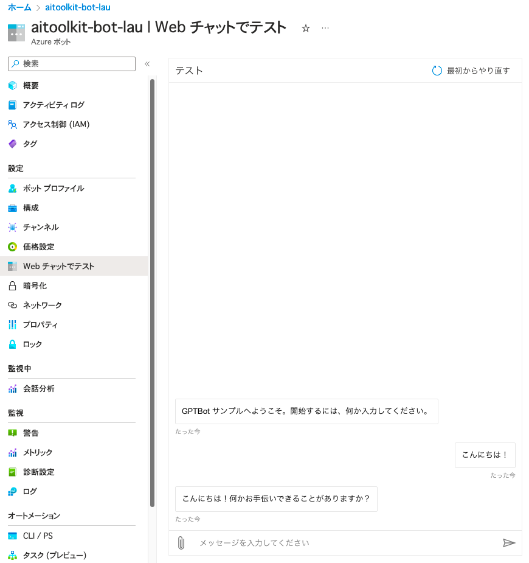
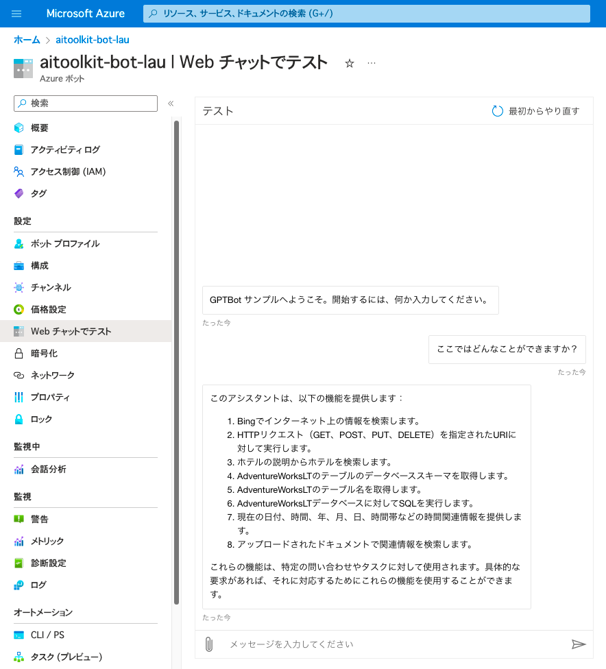
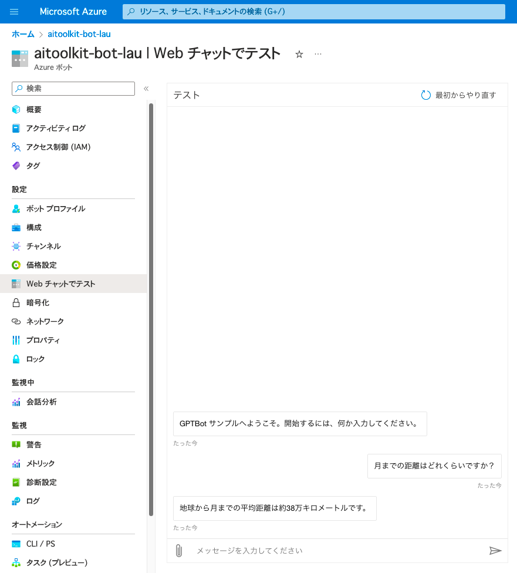
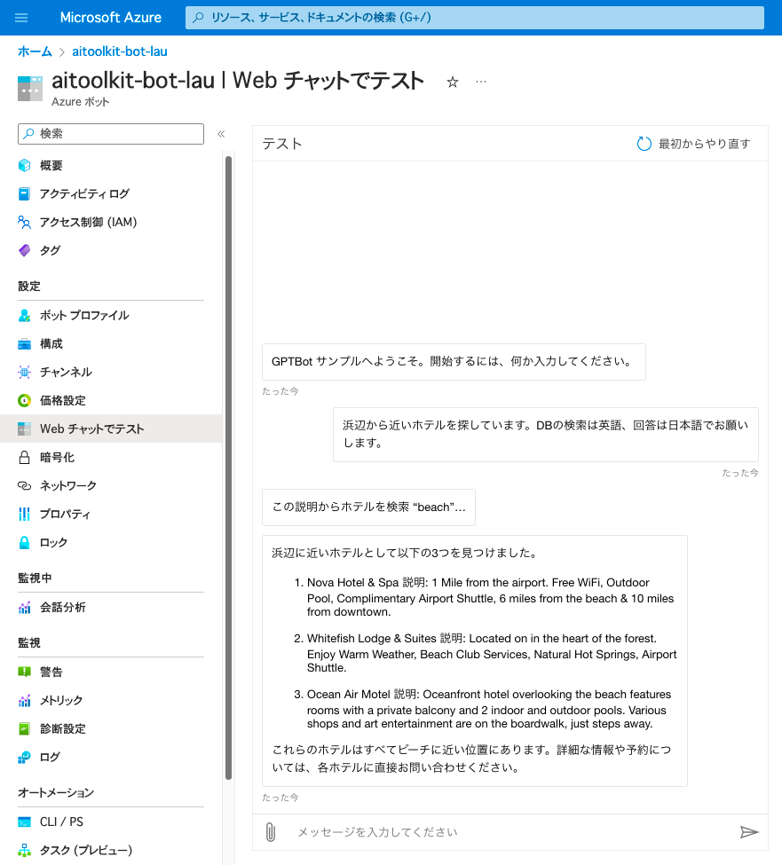
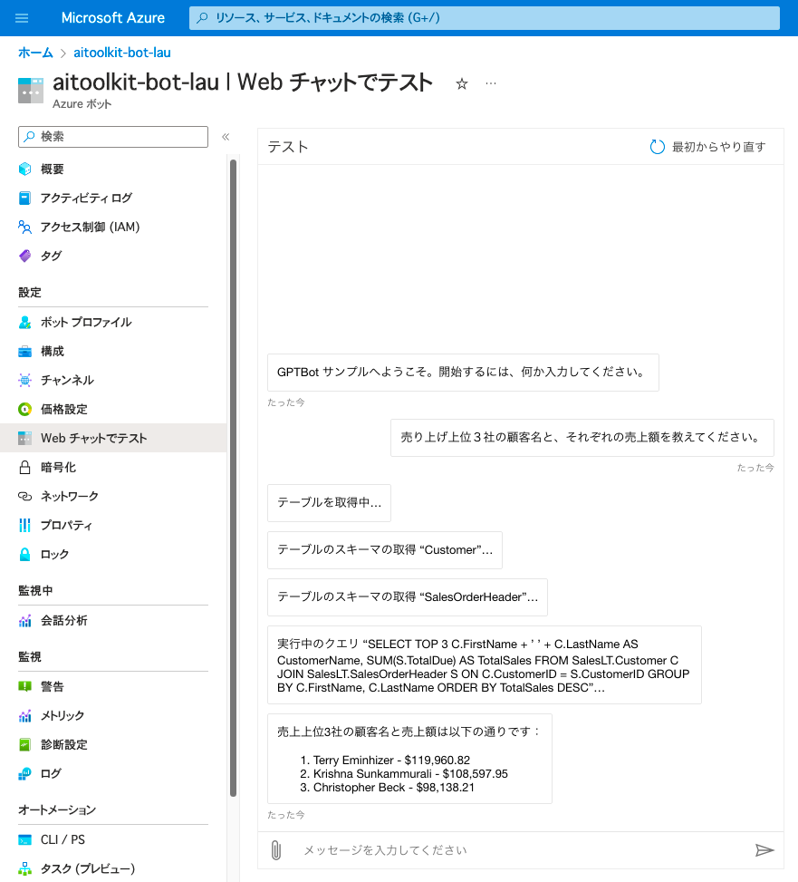
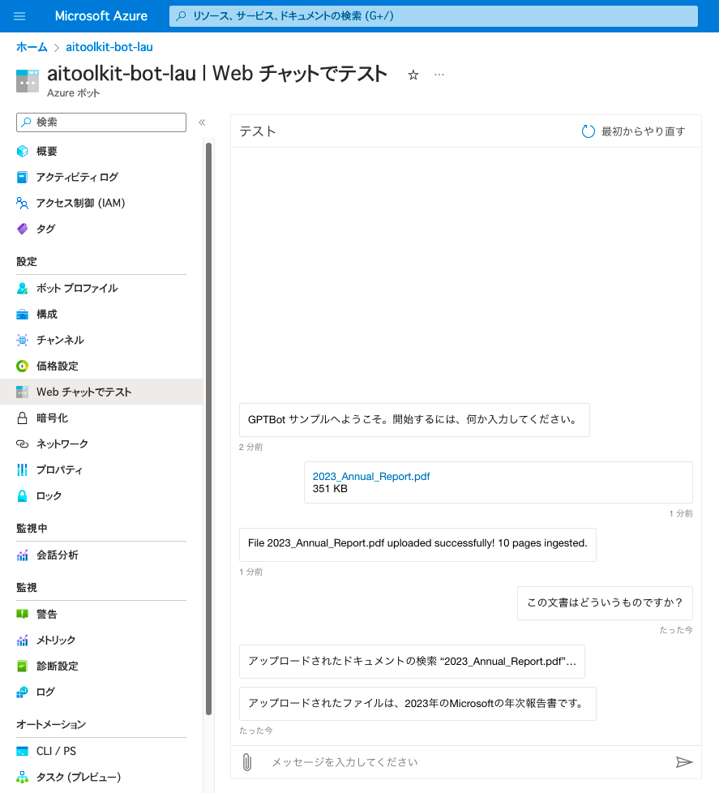
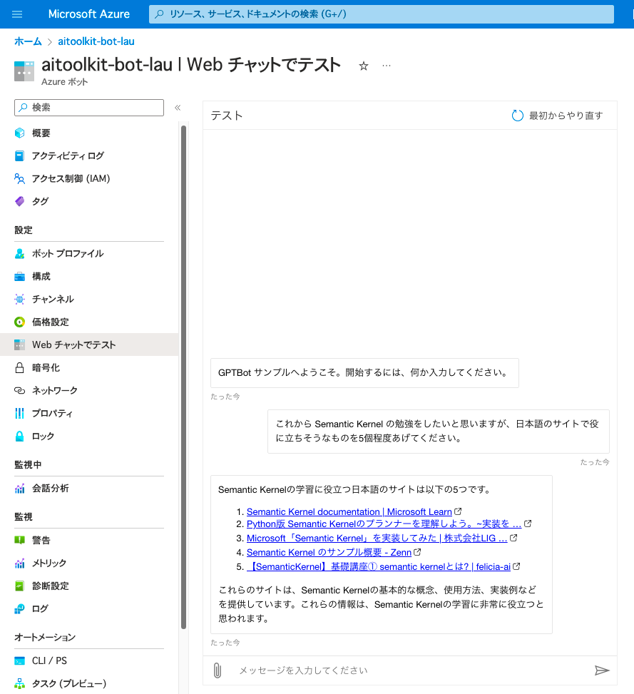
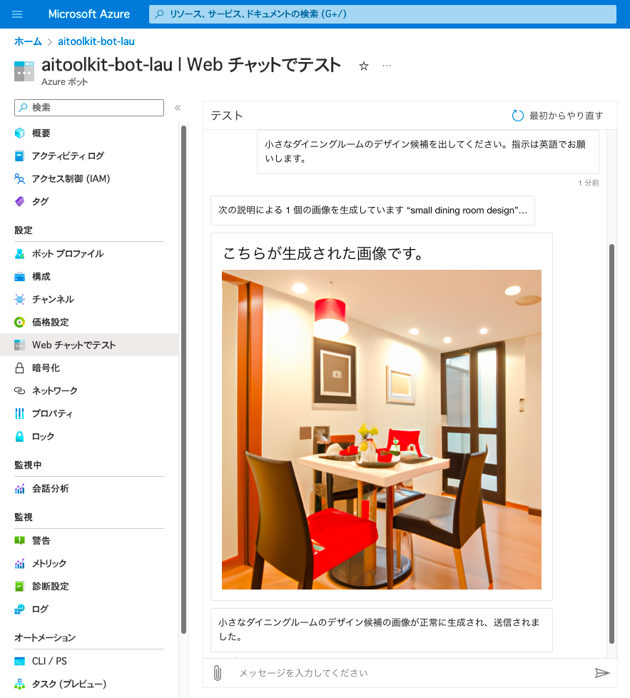

# Semantic Kernel Bot in-a-box


このプロジェクトでは、拡張可能な Semantic Kernel ボット テンプレートを Azure にデプロイします。

## ソリューションアーキテクチャ

ソリューションのアーキテクチャを次の図に示します。


メッセージの流れは次のとおりです:

- エンド ユーザーは、ボットが公開されているメッセージング チャネル (Web、PowerBI ダッシュボード、Teams など) に接続します。
- メッセージは、App Services で実行されている .NET アプリケーションと通信する Azure Bot Services を介して処理されます。
- NETアプリケーションは、Semantic Kernel ステップワイズプランナーをコアで実行します。プランナーは、ユーザーの要求を処理するための一連の手順を詳しく説明し、それを実行します。
- 計画の各ステップは Azure OpenAI によって策定され、Cognitive Search (従来の RAG パターン) または Azure SQL (構造化データ RAG) に対して実行されます。
- Cognitive search にはホテルのインデックスが含まれ、Azure SQL には AdventureWorksLT サンプルの顧客データが含まれます。Azure OpenAI は、各質問のルーティング先のデータ ソースを決定する役割を担います。質問は、複数のデータソースにまたがる場合もあります。詳細については、「サンプル シナリオ」セクションを参照してください。


## 前提条件

- ローカルで実行する場合:
    - [.NET のインストール](https://dotnet.microsoft.com/en-us/download);
    - [Bot Framework Emulator のインストール](https://github.com/Microsoft/BotFramework-Emulator);

- Azure にデプロイする場合:
    - Azure CLI をインストール
    - Azure Developer CLI をインストール
    - Azure サブスクリプションにログイン

    ```
    azd auth login
    ```

## Azure へのデプロイ

1. このリポジトリをローカルにクローンします。

```
git clone https://github.com/Azure/AI-in-a-Box
cd semantic-kernel-bot-in-a-box
```
2. リソースをデプロイします:
```
azd up
```
サブスクリプション、リージョン、および GPT モデル情報の入力を求められます。続行するときは、使用するリージョンでの GPT モデルが利用可能か確認してください。

3. Web チャットでテストする - Azure portal で Azure Bot リソースに移動し、左側のメニューで Web チャット機能を探します。




## ローカルで実行する (最初にリソースを Azure にデプロイする必要があります)

デプロイ テンプレートを実行した後、開発とデバッグのためにアプリケーションをローカルで実行することもできます。

- 適切なアクセス許可があり、Azure CLI にログインしていることを確認します。リソース グループ レベルでの "AI 開発者" ロールをお勧めします。
- `src` ディレクトリに移動し、`appsettings.example.json` ファイルを探します。名前を `appsettings.json` に変更し、必要なサービス エンドポイントと構成を入力します
- プロジェクトを実行します。
```
    dotnet run
```
- Bot Framework Emulator を開き、http://localhost:3987/api/messages に接続します
- ファイアウォールが制限されている可能性のあるサービスへのアクセスを有効にすることを忘れないでください。既定では、SQL Server はパブリック接続が無効になっています。

## サンプルシナリオ

このアプリケーションには、GPT-4自体、Cognitive Search、SQL、およびエンドユーザーがアップロードしたドキュメントからの情報を直接使用する機能があります。これらの各データ ソースには、いくつかのサンプル データがプリロードされていますが、接続をテンプレートとして使用して、独自のデータ ソースを接続できます。

各機能をテストするために、次のトピックについて質問できます

1. 利用可能な関数を確認する
    - 実装されている関数について尋ねる。


1. 一般的な知識の質問
    - 公開されている知識について尋ねる。


1. 検索拡張生成(SearchPlugin)
    - 説明に一致するホテルを探すように依頼します。


1. 構造化データ取得 (SQLPlugin)
    - 顧客と売上について尋ねる。


1. ドキュメントをコンテキストとしてアップロードする (UploadPlugin)
    - ファイルをアップロードし、それについて質問します。


1. Bing 検索を使用してインターネット上の情報を検索する (BingSearchPlugin)
    - インターネットで検索したい内容について質問します。


1. Semantic Kernel の Core Plugin ([TimePlugin](https://github.com/microsoft/semantic-kernel/blob/main/dotnet/src/Plugins/Plugins.Core/TimePlugin.cs), [HttpPlugin](https://github.com/microsoft/semantic-kernel/blob/main/dotnet/src/Plugins/Plugins.Core/HttpPlugin.cs))
    - 時間に関するタスク、HTTPのGETやPOSTなどに関するタスクの実行

    **Note:** HTTPPlugin でWebサイトの情報取得すると大量のデータダウンロードされる恐れがあるので、対象サイトについては十分に注意してご利用ください

1. 画像の生成 (DALLEPlugin)
    - 生成したい画像を依頼します（注: 現在は DALL-E 2 のみ対応）;



## キーワード

- "clear" と発言することで会話をリセットすることができます;

## 独自のプラグインを開発する

このプロジェクトには 2 つのプラグインが付属しており、Plugins/ ディレクトリにあります。これらのプラグインは、独自のプラグインを開発する際の例として使用できます。

カスタムプラグインを作成するには:

- Pluginsディレクトリに新しいファイルを追加します。例の 1 つをテンプレートとして使用します。
- プラグインにコードを追加します。各セマンティック関数には、最上位の説明と各引数の説明が含まれており、Semantic Kernel がその機能を活用する方法を理解できるようにする必要があります。
- Bots/SemanticKernelBot.cs ファイルにプラグインをロードします

これで完了です。アプリを再デプロイすると、Semantic Kernel は、ユーザーの質問でプラグインが必要になるたびにプラグインを使用するようになります。

## Web チャットの有効化

アプリの Web チャット バージョンを展開するには:

- Azure Bot リソースに移動します;
- チャネルに移動します;
- Direct Line をクリックします;
- Direct Line Secretを取得します;
- シークレットを App Service の環境変数のキー DIRECT_LINE_SECRET の下に追加します;
- Bot は https://APP_NAME.azurewebsites.net で利用できるようになります。

これを実施した場合、認証/SSOを実装しない限り、ボットがグローバルに公開されることに注意してください。

## プライベート・エンドポイントを使用したデプロイ

このアクセラレータでパブリック アクセスを無効にしてこのサンプルをデプロイする場合は、[Cognitive Services Landing Zone in-a-box アクセラレータ](https://github.com/Azure/AI-in-a-Box/tree/main/cognitive-services-landing-zone-in-a-box)を使用できます。これを行うには、以下の手順に従ってください。

1. [Cognitive Services Landing Zone in-a-Box](../cognitive-services-landing-zone-in-a-box/) を展開します。

2. このサンプルは、同じ environmentName パラメーターと appName パラメーターを使用してデプロイします。publicNetworkAccess の入力を求められたら、"Disabled (無効)" を選択します。サービスを手動で構成し、VPN / ExpressRoute 接続を設定していない場合は、代わりにパブリック アクセスを "有効" にしてデプロイし、構成を実行してから、パブリック アクセス "Disabled (無効)" で再デプロイできます。

3. デプロイされたすべてのサービスにプライベート エンドポイントと無効なパブリック ネットワーク アクセスが含まれるようになります。パブリック接続を必要とするすべてのサービスへのアクセスを再度有効にしてください。

## 貢献

このプロジェクトは、貢献と提案を歓迎します。 ほとんどのコントリビューションでは、コントリビューターライセンス契約(CLA)に同意して、コントリビューションを使用する権利があり、実際に付与することを宣言する必要があります。詳しくは https://cla.opensource.microsoft.com をご覧ください。

プルリクエストを送信すると、CLAボットはCLAを提供し、PRを適切に装飾する必要があるかどうかを自動的に判断します(ステータスチェック、コメントなど)。ボットの指示に従うだけです。これは、CLA を使用するすべてのリポジトリで 1 回だけ行う必要があります。

このプロジェクトでは、[Microsoft Open Source Code of Conduct](https://opensource.microsoft.com/codeofconduct/)を採用しています。
詳細については、[行動規範に関するFAQ](https://opensource.microsoft.com/codeofconduct/faq/)または
その他の質問やコメントについては、[opencode@microsoft.com](mailto:opencode@microsoft.com)にお問い合わせください。

## 商標について

このプロジェクトには、プロジェクト、製品、またはサービスの商標またはロゴが含まれている場合があります。Microsoft の商標またはロゴの許可された使用は、[Microsoft の商標およびブランド ガイドライン](https://www.microsoft.com/en-us/legal/intellectualproperty/trademarks/usage/general) に従う必要があります。
このプロジェクトの修正版での Microsoft の商標またはロゴの使用は、混乱を招いたり、Microsoft のスポンサーシップを暗示したりしてはなりません。
第三者の商標またはロゴの使用は、それらの第三者のポリシーの対象となります。
